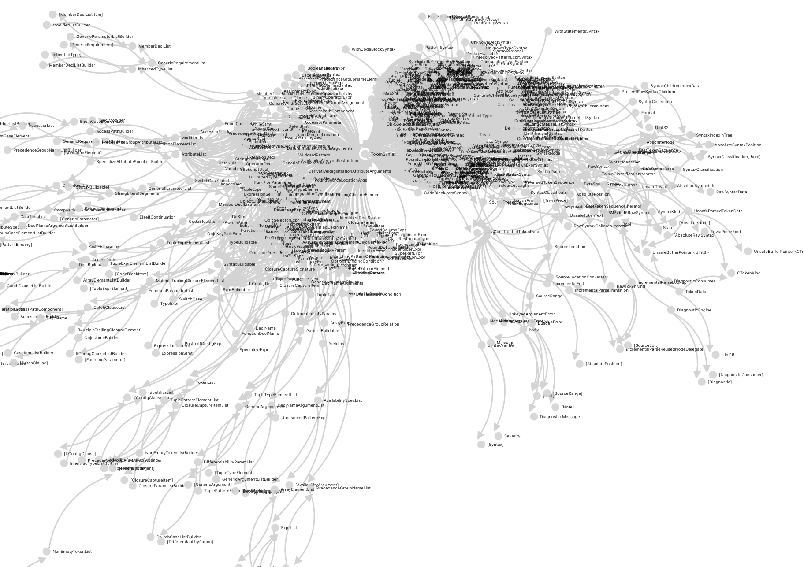

# swift-project-analyzer

THIS PROJECT IS STILL WORK IN PROGRESS

- `make run`
- `cd web && yarn install && yarn start`

# Example Result

I run this project against [swift-syntax](https://github.com/apple/swift-syntax/tree/main/Sources/SwiftSyntax)

# Todo 

 - Build Connections from protocol to its conforming type
